<div align="center">

# WorkLoom 获客系统

**短视频社媒营销 × GEO × 获客五环——把获客从玄学，变成一门可测量、可追溯、可归因的生意。**

一支 AI 获客班组住进你的通讯录：找人群、做内容、接询盘、跟线索、算成交——
你只做三件事：**定方向、拍板、收钱。**

[](LICENSE)
[](https://github.com/geniusdapeng-collab/workloom)

</div>

---

## 产品定位

WorkLoom 获客系统是一套**面向 B 端商家的 AI 获客经营系统**：以「短视频社媒营销 + GEO（生成式引擎优化）」双引擎触达客户，以「获客五环」（意图洞察 → 双域触达 → 四路承接 → 线索转化 → 归因复盘）闭环经营，每一环都可度量到钱。首个深度垂直行业是**酒店**（社媒营销 × GEO × 获客 × 酒店运营一体），底座支持向各行业复制 Bundle。

开过店、做过生意的人，都懂这三笔账：

> **第一笔：流量越来越贵。** 投流成本年年涨，内容不发就没声量，发了没转化就是给平台打工。
> **第二笔：询盘接不住。** 评论区一句「怎么订」半小时没人回，客户就去别家了——夜间、高峰期的询盘流失率超过 70%。
> **第三笔：佣金被抽走。** 以酒店为例，OTA 佣金 15-25%——你辛苦服务一整晚，平台躺着抽走四分之一。

还有一个正在发生、但大多数人没看见的变化：**42% 的消费者已经开始用生成式 AI 查消费信息**——「杭州亲子酒店哪家好」「xx 牌子的激光切割机靠谱吗」。AI 搜索里没有你，你就失去了一个爆发中的新入口。

| 传统获客的死法 | WorkLoom 获客系统的活法 |
|---|---|
| 广撒网做内容，不知道给谁看 | **意图雷达**：竞对评论区 / 搜索 query / 差评里萃取「谁在为这个问题找答案」，先有人群再有内容 |
| 内容发完就完，转化靠缘分 | **双域触达**：短视频社媒种草 + GEO 六段式占领 AI 搜索答案，一次生产两处变现 |
| 询盘半夜流失，白天排队回复 | **四路承接**：AI 接待员 7×24（评论 / 私信 / 落地页 / AI 搜索行动锚点），30 秒首响，报价必过人审 |
| 线索躺在表格里没人跟 | **线索分级**：A 级 1 小时内派单到人，B 级进培育池，C 级私域喂养 |
| 不知道哪条内容赚了钱 | **归因到钱**：每条线索带来源链，成交回写——北极星就是「归因成交额」 |

**获客的精髓就一句话：在对的地方，用对的内容，接住有意图的人，并且每一环都能度量到钱。**

<!-- CAPABILITIES:BEGIN -->
<!-- 本区块由 scripts/generate-capabilities.mjs 自动生成（2026-08-29），请勿手改；重跑 pnpm capabilities 更新 -->

## 🧩 系统能力速览（自动生成 · 与代码同步）

- 🖥 **三端应用（开箱即看）**：PC 端 · B 端工作台 · 移动端 · B 端高保真 · 移动端 · C 端 AI 服务前台
- 🧲 **行业 Bundle（垂直能力包）**：bundles/ai-video/ · bundles/geo-growth/ · bundles/hotel/
- 🖐 **操作电脑能力（本仓自带 · 可装生产工作站）**：computer-use 三层感知（65 动作） · HTTP 远程驱动 + MCP server
- 🤖 **AI 自动化引擎（系统内置能力）**：围栏 DSL 引擎 · L2 编排（ASK/QUEST） · 夜班自动运行 · 模型路由 · 全平台 RPA 发布 · 五元事件 + RLS 隔离 等 14 项
- ✅ **验证与质量（工程纪律）**：一键安装（bootstrap） · 主测试套件 · GEO 域套件 · 酒店域套件 · 发布门禁 · 五元事件验链 等 8 项
- 🎁 **演示与交付资产**：高保真演示页 ×12 · 官网静态站 · 自带技能 ×7 · 能力导览 PPT · Mock 数据体系

> 📖 完整能力导览（含截图与体验路径）：[docs/capabilities.auto.md](docs/capabilities.auto.md) ｜ 🤖 AI Agent 入口：[AGENTS.md](AGENTS.md) ｜ 🎯 首启必跑：`pnpm preview:all`
<!-- CAPABILITIES:END -->

---

## 核心能力

### 获客五环：每一环都可度量到钱

系统里每天都在自动运转的五环闭环：

1. **意图雷达**：竞对评论区 / OTA 差评 / query 词 / 本店私信四矿源萃取，每周《意图雷达报告》反向指挥选题——先有人群，再有内容；
2. **双域触达**：短视频 + 直播卖券 + GEO 六段式（问题前置 → 直接答案 → 参数表格 → 清单建议 → 实体锚点 → 信源引用），一次生产、社媒与 AI 搜索两处变现；
3. **四路承接**：AI 接待员 7×24 在线（评论区 / 私信 / 落地页 / AI 搜索行动锚点），30 秒首响；询价自动转人审（围栏 R21，AI 不许私自报价）；
4. **线索转化**：通兑券「先囤后约」+ 库存熔断（R22）+ 定价红线（R26）；A 级线索 1 小时派单到人，B 级培育，C 级私域喂养；
5. **归因复盘**：六级漏斗（曝光 → 互动 → 询盘 → 留资 → 成交 → 复购）+ **归因成交额**北极星 + **OTA 佣金节省对照**——每条成交都知道自己从哪来。

### 双域融合：短视频社媒营销 × GEO

AI 搜索月活破 8.2 亿、AI 问答流量占比首超传统搜索——客户越来越多地先问 AI，再决定买谁。**GEO 就是让 AI 替你说话的生意**。两个经营域共享一个情报站、一条内容生产线、一套分发基建、一张战报、一条私域转化链路：

| 协同机制 | 一句话 |
|---|---|
| 选题情报双向流动 | 情报站每日统一情报卡，双用选题优先排产——一条 AI 高频问题，同时产出短视频和 GEO 图文 |
| 内容一次生产、两处变现 | 脚本成套包固定字段「AI 答案适配版」：人审通过后 GEO 改写自动触发（六段式），零边际成本，双审不省 |
| 分发渠道统一编排 | publish-rpa 分两组：社媒组（抖音 / TikTok / 小红书 / YouTube / Meta）+ 信源组（知乎 / 头条号 / 百家号 / 公众号 / 新闻稿 / 垂媒 / 百科），同一套模拟人工纪律 |
| 全网存在感战报 | 固定三栏：社媒侧（播放 / 涨粉 / 互动 / 询盘）/ GEO 侧（提及率 / 首推率 / SOV / 引用源变化）/ 交叉侧（双入口询盘对比） |
| 询盘双入口进同一私域 | 社媒私信 vs AI 搜索 → 官网 → WhatsApp，全部来源打标进同一私域 |

**GEO 不是灰帽**：四条围栏焊死底线——GEO 内容外发必审、事实红线一票否决（品牌实体信息与实体卡逐字一致）、语料污染 / 伪造多源 / 机器刷量熔断、信源日发超限熔断。每个能见度数据都有原始答案截图存证，每个 AI 决策都进回测账本。完整方案见 [社媒短视频营销 × GEO 融合经营系统落地执行方案](docs/geo-fusion-plan.md)，代码全部在 [`bundles/geo-growth/`](bundles/geo-growth/)——**底座零改动，一切能力经 Bundle 注入**。

### 酒店垂直：社媒营销 × GEO × 获客 × 运营一体

把双域能力扎进一个垂直行业：酒店运营域（围栏基线 R1-R26、29 个官方技能、16 个数码员工、低星单体 / 民宿 / 无人酒店三客群分型）+ 酒店获客域（获客五环）+ 外部连接器（PMS / 抖音本地生活 / OTA 监测 / 企微，mock 先行）。运营与获客一个 Bundle 承载，一店一档只有一份。

> **一句话价值主张**：「白天空房不用愁——短视频 + AI 搜索帮你接客；晚上店长放心睡——夜班 + 语音前台帮你守店；OTA 佣金不用交——直连成交帮你省钱。」

### 夜班模式：你睡了，店还开着

夜班锚的不是「AI 的工作时间」——AI 本来就 24 小时全勤——而是**人的离线时间**，获客链路 24 小时不断：

- **触达免打扰**：非 P0 不叫人，一切聚合为 08:30 晨报
- **权限自降级**：夜间防守性动作自治，对外承诺一律留痕可审
- **高峰窗口三线合一**：内容线抓流量晚高峰排期发布与评论区承接；转化线夜间客询即时应答（GEO / 线索跟进不断线）；运营线守夜兜底（差评 SLA 扫描 / 价格巡检 / FAQ 萃取）
- **成本洼地**：视频渲染与批量内容生产落在谷时算力窗口执行

### 数字 CEO：获客团队的总经理

数码员工解决「手」的问题，数字 CEO 解决「脑」的问题。它统领双域班组（14 员 + 2 指挥官：情报组 / 内容组 / 分发组 / 数据组 / 经营组，公司 CEO 管客户、集团 CEO 管全盘），做决策、带团队、向你汇报：

- 常规选题按策略自动排产；重大方向调整走六步深度分析报你拍板
- 小额投流测试自主，超预算上限必请示；连续不达标的员工出具汰换诊断书报你批准
- 出厂默认关闭，启用须完成六步深度授权；先当 3 天「影子」只模拟不执行，再 7 天试用（权限减半），到期不自动续期；五级权限，禁区物理熔断，每个决策都写进不可篡改的事件账

### 通用模型路由：获客链路的每一分钱都花得清楚

三个行业 Bundle 共享同一底座路由内核，每一次模型调用按场景定档、按倍率计量、按事件可审：

- **三行业场景路由表**：`bundles/hotel`（客服 / 语音前台 L1、六步深度 L3、体检报告平台成本）· `bundles/ai-video`（预生产 / 导演评审谷时 L2、渲染三供应商降级链）· `bundles/geo-growth`（询盘应答 L1 秒级保转化、GEO 内容批量谷时 L2、投放战役策略 L3 noDowngrade）
- **渲染额度台账 + 预算闸**：套餐秒数配额，围栏后超支未确认即熔断；Seedance → 可灵 → 即梦降级链 + 轮询回填
- **积分三池账本 + 加油包**：P1 积分账本面板，五档加油包；售前体检 `bill_to: platform` 平台成本——获客补贴烧在刀刃上
- **👍/👎 反馈环**：Ask 应答卡一键升级重答（点踩换更强大脑，首次免费），反馈数据回流驱动路由调表

**商业化锚点**：智享 499 / 标准 1,299 / 智能 2,999 元每店每月——用不到一个获客专员的月薪，买下「流量 → 询盘 → 成交」全链路的 AI 获客团队。

### WorkData 数据底座：素材、线索与过程全留痕

- **素材库**：商品图、参考图、定妆照、片段、成片，全部带版本链和溯源，sha256 幂等去重
- **渲染脚本 CMS**：每条镜头脚本都是版本化的 Markdown，改完自动重跑质量校验；手动单镜渲染、整片批量渲染、全自动连锁三档任选
- **组织记忆**：每条片子、每次投放的创作与决策过程沉淀为可检索的记忆
- **全程留痕**：每个镜头、每次审批、每次发布、每条回复都是 append-only 五元事件，SHA-256 哈希链防篡改，崩溃重放零丢失

---

## 系统截图（模拟运行态实拍）

以下截图均来自系统**模拟运行态**（Mock 模式：种子演示数据 + 离线确定性模型），页面顶部琥珀色横幅「当前为全模拟运行态」为系统原生标识；PC 端为云栖酒店工作区（ws-yunqi · 主推的酒店获客经营演示）。

### PC 端 · B 端工作台

| 经营剧场（默认首页） | 工作台 · 总览 |
|---|---|
| 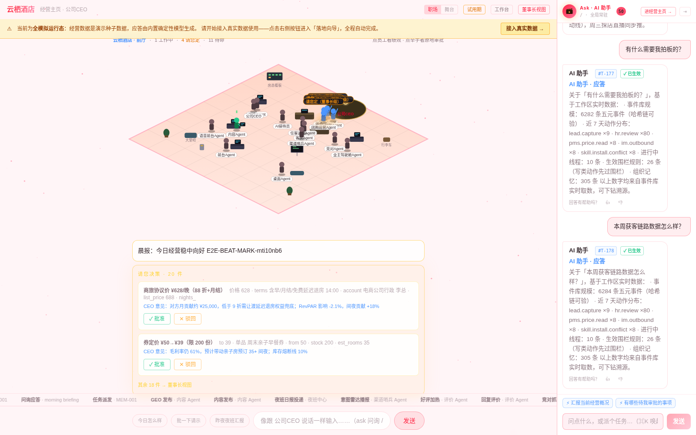 | 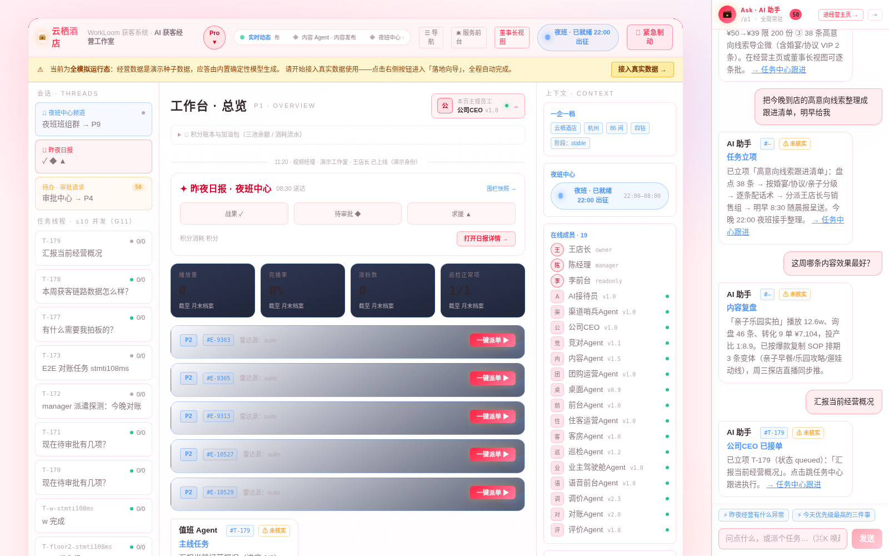 |

| 审批中心 | 规则与权限 |
|---|---|
| 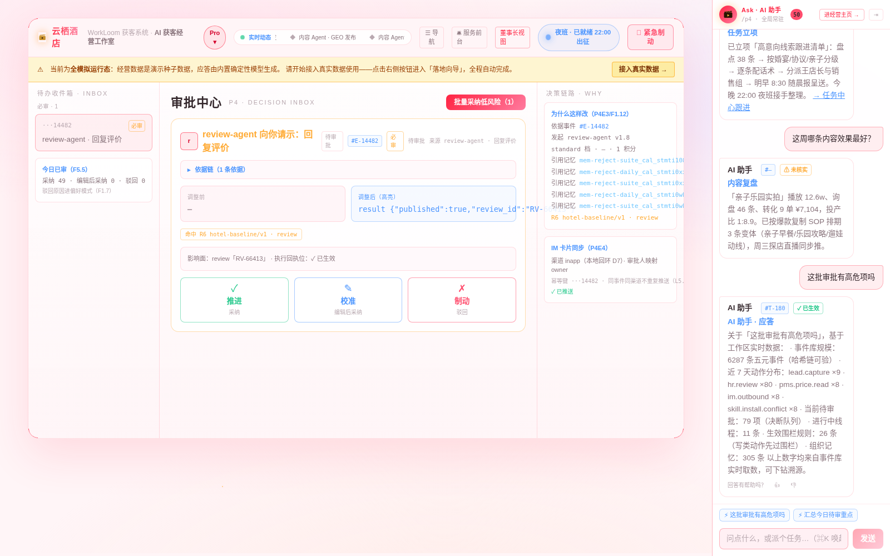 | 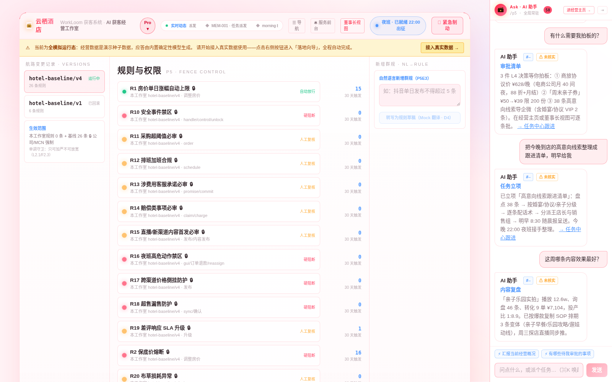 |

| 技能中心 | 夜班中心 |
|---|---|
| 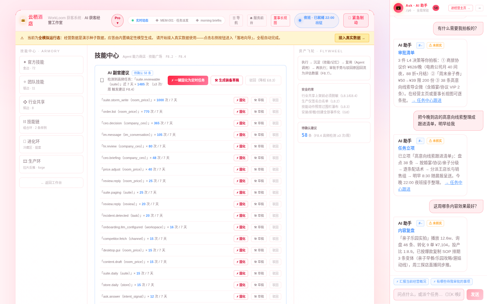 | 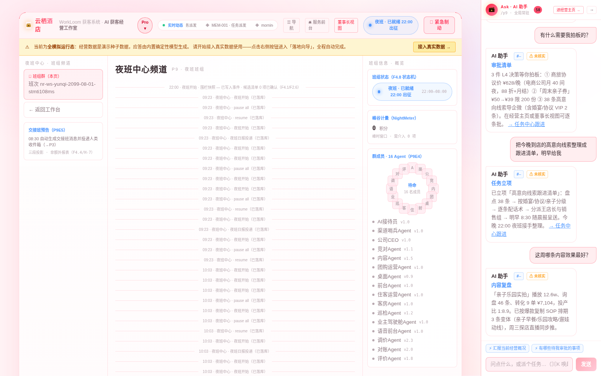 |

| 片库 · 渲染脚本 CMS | 落地向导（接入真实数据） |
|---|---|
| 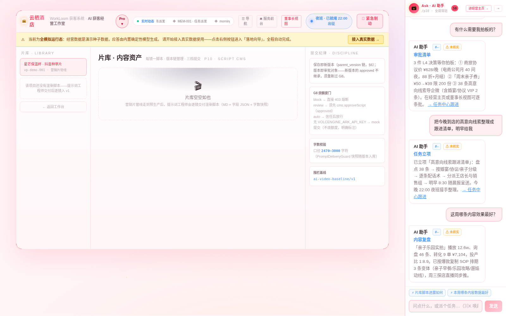 | 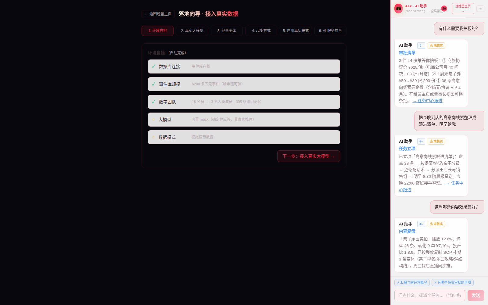 |

### 移动端

| B 端 · 店长驾驶舱 | C 端 · 住客小程序 | C 端 · AI 服务对话 | C 端 · 服务大厅 |
|---|---|---|---|
| 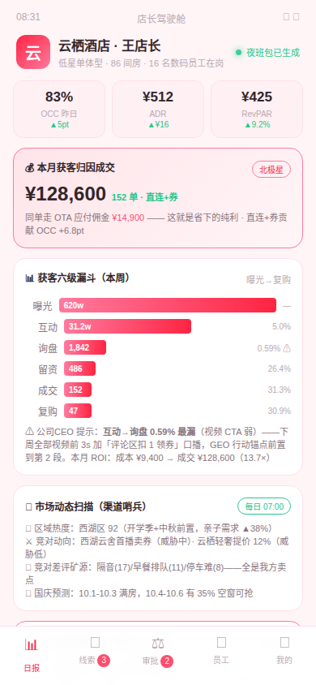 | 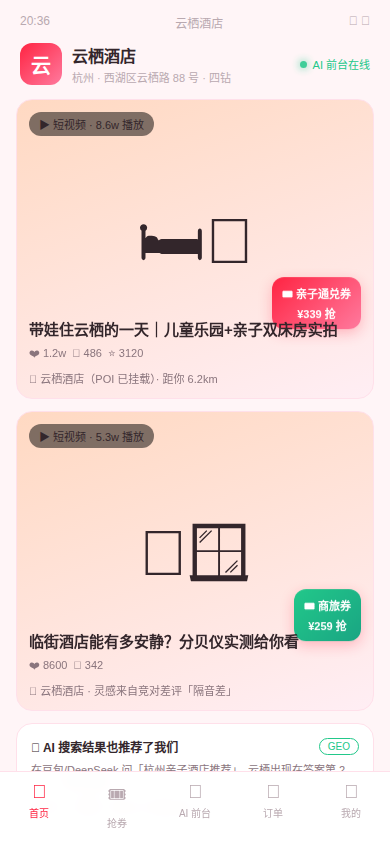 | 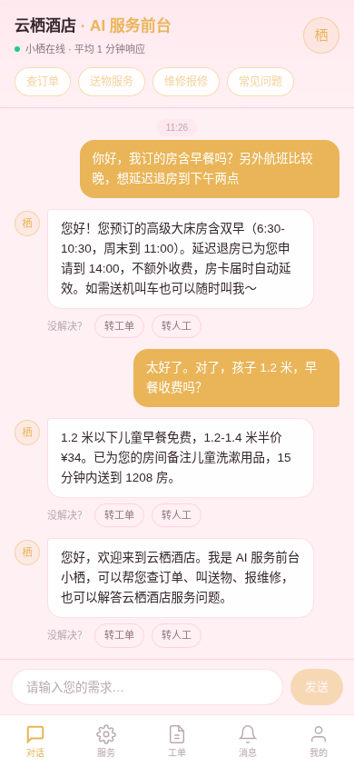 |  |

---

## 使用方式

### 三种姿势，融入经营日常

**Ask · 问答模式 —— 你的经营参谋。**「本周获客链路数据怎么样？」「这周哪条内容效果最好？」随口问，系统基于事件库实时数据、历史归因和组织记忆回答。不问过程，只要答案。

**Quest · 目标模式 —— 你出目标，它出结果。**「给亲子房出 3 条抖音种草片，周五前要。」系统自动拆解成任务卡链条：调研 → 策划 → PRD → 剧本 → 分镜 → 提示词 → 定妆照 → 渲染 → 后期 → 发布 → 监控。断点续跑——中途改主意、改素材、改预算，接着跑，不重来。

**自动化编排 —— 睡后收入的基础设施。**「每周一三五晚 8 点发抖音，发完自动盯数据，差评 30 分钟内给我处置建议。」用触发器把重复性经营动作编排成 7×24 自动流：定时发布 → 数据采集 → 评论分流 → 战报生成。编排一次，天天受益。

### 先体检，再托管

把店交给系统之前，先知道**链路现在漏在哪个环节**。质检模式（Audit-Only）是前置闸：**系统只读扫描、一个字都不写回**，先出体检报告，再谈托管：

- **快照快扫**（fast-scan 技能）：授权 PMS / OTA + 社媒账号 + GEO 数据后 15–30 分钟完成双线静态扫描，当场出《获客全链路快速体检报告》——按「流量 → 转化 → 成交」链路排序的 Top10 行动清单，每条带证据与估算挽回金额
- **持续体检**（1–2 周）：捕捉只有时间能回答的问题——首响时长实测、差评 SLA 履约、内容节律趋势、能见度周环比
- **双线扫描**：酒店运营线（价格倒挂 / 超售漏售 / 渠道对账差异 / 存量差评 / 担保异常）+ 获客转化线（账号健康 / 内容节律 / 未承接高意向 / GEO 可见度缺口 / 线索流失点）
- **围栏纪律**：体检期一切对外写操作物理阻断（调价 / 退款 / 排房 / 发布 / 回评论 / 私信 / 投放），上岗员工全部是只读 / 分析岗；体检基线自动留存，托管后每月 diff 产出《整改闭环率》

看到漏的钱之后，再一键切换影子模式（3 天只看不做）→ 正式托管（低星单体 / 民宿 / 无人酒店三客群）。

---

## 快速开始

### 一键跑起来（推荐）

```bash
git clone https://github.com/geniusdapeng-collab/workloom.git
cd workloom
pnpm setup && pnpm preview:all
```

`pnpm setup` 是一键安装：环境检查 → `.env` → 依赖 → PostgreSQL（docker compose 自动建容器）→ 迁移种子 → 可选「操作电脑」桌面栈，幂等可重复跑。`pnpm preview:all` 一键拉起**三端全貌**并自动固化 Mock 模拟数据（无需任何真实后端 / 密钥）：

| 端 | 地址 | 说明 |
|---|---|---|
| PC 端 · B 端工作台 | http://localhost:3000 | 经营剧场 / 任务中心 / 规则中心 / 装配中心 |
| 移动端 · B 端 | http://localhost:3001 | 高保真演示页 + 手机壳容器（12 页自动发现） |
| 移动端 · C 端 | http://localhost:3002 | AI 服务前台 H5（小程序入口模拟，演示直登） |

> **首次启动必须执行 `pnpm preview:all`**，否则视为未完成环境初始化。Mock 数据口径见 [`mock/README.md`](mock/README.md)；验收清单见 [`PREVIEW_CHECKLIST.md`](PREVIEW_CHECKLIST.md)。

### 手动分步（三套演示工作区任选）

```bash
docker compose up -d postgres     # PostgreSQL 17 + pgvector
cp .env.example .env              # 首次必须（db:* 脚本依赖 --env-file=.env）
pnpm install
pnpm db:migrate
pnpm db:seed         # 酒店获客经营演示（yunqi-hotel 工作区 · 主推：获客五环全链）
pnpm db:seed:video   # AI 视频制作经营演示（video-studio 工作区）
pnpm db:seed:geo     # 社媒×GEO 双域代运营演示（geo-growth 工作区）
pnpm dev             # server :8787 / web :5173
```

PC 端默认进入 `video-studio` 工作区；切换主推的酒店获客工作区：启动 web 时设置 `VITE_DEMO_WORKSPACE=yunqi-hotel`（成员 `VITE_DEMO_MEMBER=MEM-001`）。

**双端演示原型**（浏览器直接打开）：`docs/demo/hotel-owner-app.html`（B 端店长驾驶舱）/ `docs/demo/hotel-guest-app.html`（C 端住客小程序）。

### 从模拟运行态到真实数据

种子完成后系统即进入**全模拟运行态**：经营剧场、数字 CEO 简报、待决策请示、实况字幕流，全部为演示数据 + 内置确定性模型（零外部依赖）。页面顶部常显琥珀色横幅提示「当前为全模拟运行态」，点击「接入真实数据 →」进入**落地向导**（`/onboarding`）：

1. 环境自检（自动）
2. 接入真实大模型（DeepSeek / Kimi / 智谱 / OpenAI 预设一键填，真实试调通过才落盘，保存即全链生效免重启）
3. 登记经营主体
4. 启用真实模式（横幅熄灭，全程五元事件留痕）

Ask 问询另支持联网实时检索事实面（`ASK_WEB_SEARCH=1`，Bing RSS，免密钥）。

---

## 面向 AI Coding Agent

本仓库对 AI Coding Agent 原生友好，进仓请按以下顺序：

1. **先读 [`AGENTS.md`](AGENTS.md) 与 [`.ai-prompt`](.ai-prompt)**——仓库的强制约定与入场指引；
2. **首启必跑 `pnpm preview:all`**，未完成视为环境初始化未完成；
3. **一键能力巡游 `pnpm agent:tour`**（`--full` 追加种子编排 + 全部测试套件 + 发布门禁），全量能力清单见 [`docs/capability-map.md`](docs/capability-map.md)；
4. **本仓自带「操作电脑」能力**（`packages/base/computer-use/`，65 动作三层感知：L1 浏览器 DOM 级 / L2 全 GUI 语义树 / L3 截图像素级，不依赖任何沙箱）：`pnpm computer:preflight && pnpm computer:smoke` 即验；可装到生产专用工作站，HTTP / MCP 远程驱动见 [`docs/computer-use-production.md`](docs/computer-use-production.md)；
5. **验证纪律**：改完代码必跑 `pnpm suite`；发布前必跑 `pnpm release:gate`；改事件 / 号源后跑 `pnpm db:verify-chain`；UI 改动必须用浏览器能力实际打开页面截图核对；改了能力面必须跑 `pnpm capabilities` 重新生成导览。

---

## 技术要点

| 能力 | 一句话 |
|---|---|
| 获客五环引擎 | 意图雷达 → 双域触达 → 四路承接 → 线索转化 → 归因复盘，北极星「归因成交额」+ OTA 佣金节省对照 |
| GEO 六段式 | 问题前置 → 直接答案 → 参数表格 → 清单建议 → 实体锚点 → 信源引用；能见度数据原始答案截图存证，敢拿命中率接效果对赌 |
| 好莱坞级制作引擎 | 融合 SuperMickey 四层架构（剧本 → 制作 → 渲染 → 后期），25/30 字段镜头卡、5 维导演评分、203 个导演级技能库 |
| 审批门与围栏 | 情报 / 主题 / PRD / 定妆照 / 提示词 / 渲染 / 发布 / 评论等原生审批门，围栏三级授权（自动 / 审批 / 禁止），报价 / 外发必过人 |
| 事件溯源底座 | 五元事件 append-only + SHA-256 哈希链（WorkData），「模型可见即已记录」，崩溃重放零丢失 |
| Quest 引擎 | 目标自动拆解为任务卡，replay 断点续跑——长链路生产不怕中断 |
| 全平台 RPA 分发 | 社媒组 + 信源组双组编排，模拟人工节奏防风控，单账号 / 单信源日上限熔断 |
| 行业 Bundle | 垂直能力包机制：`bundles/hotel/`（酒店运营+获客）、`bundles/ai-video/`、`bundles/geo-growth/`，围栏 / 技能 / 管线 / UI 随包分发，底座零改动 |

## 仓库结构

| 目录 | 内容 |
|---|---|
| `apps/server` | tRPC 服务端（:8787） |
| `apps/web` / `apps/webc` | B 端 PC 工作台 / C 端 AI 服务前台 H5 |
| `apps/site` | 官网静态站（含实机截图） |
| `packages/base` | 底座包：workdata（事件 / RLS）、fence-engine（围栏 DSL）、publish-rpa（全平台分发）、computer-use 等 |
| `bundles/` | 行业 Bundle：`hotel/`、`ai-video/`、`geo-growth/` |
| `skills/official/` | 自带技能 ×7 |
| `scripts/` | 测试套件（主套件 / GEO 域 / 酒店域）、种子、发布门禁、能力巡游、三端预览 |
| `docs/` | 方案文档、能力地图、用户指南、12 页高保真演示页 |

## 文档索引

- [完整能力导览（自动生成）](docs/capabilities.auto.md) ｜ [全量能力清单](docs/capability-map.md)
- [获客系统升级方案（获客五环 / 酒店垂直 / 分期落地）](docs/plan-acquisition.md)
- [社媒短视频营销 × GEO 融合经营系统落地执行方案](docs/geo-fusion-plan.md)
- [酒店资产迁移判断与架构方案](docs/plan-hotel-migration.md)
- [操作电脑能力生产部署指南](docs/computer-use-production.md) ｜ [浏览器自动化指南](docs/agent-computer-guide.md)
- [酒店销售一页纸 ×3 客群](docs/sales/) ｜ [行业落地三技能体系](docs/methodology/01-行业落地三技能体系.md)

## 许可证

Apache-2.0（vendor/dsh 与 vendor/dsh-im 为 MIT）。
