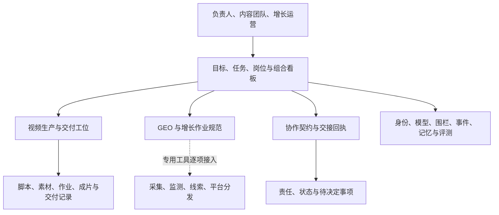
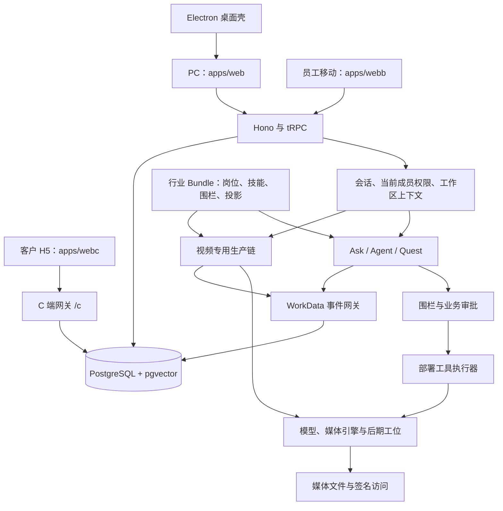

# WorkLoom 获客增长系统

WorkLoom 获客增长系统面向企业增长与内容运营团队，把目标、数字员工岗位、内容生产、任务协作和过程记录放进同一个工作空间。产品目标是连接意图洞察、社媒与 GEO 触达、线索承接、转化和复盘；当前代码中，**视频生产与交付有专用执行链，通用工作台和行业包提供组织与治理机制，部分增长工具仍处于声明或接入阶段**。

[CNB 仓库](https://cnb.cool/workloom-ai/workloom) · [产品身份](product.manifest.json) · [代码入口导览](docs/capabilities.auto.md) · [开发指引](AGENTS.md) · [Apache-2.0](LICENSE)

> 本页按当前源码说明“有什么、从哪里进入、还依赖什么”，不把岗位或技能数量当作已交付能力数，也不把模拟结果当作生产效果。旧方案、截图和演示 PPT 可帮助理解背景；发生差异时，以 manifest、当前路由和实际执行代码为准。

## 给首次接手团队的阅读顺序

1. 产品经理先看“使用场景”和“功能状态”，区分产品目标、已经有代码的链路与尚待接通的外部动作。
2. 技术团队先看“系统架构”“行业包组合”和“快速开始”，再沿源码入口追到实际执行器、数据库与回执。
3. 准备交付时，以真实环境的输入、产物、费用、失败恢复和外部回执验收；本页不提供未经实测的容量、延迟或经营收益承诺。

## 使用场景与产品边界

| 使用者 | 具体场景 | 系统中的工作方式 | 当前边界 |
|---|---|---|---|
| 内容策划与视频制作人员 | 把产品资料做成短片，管理脚本、渲染、返修与交付 | 在视频工位创建制作作业，分阶段推进预生产、渲染和后期，保留素材与成片记录 | 模型、媒体引擎、供应商账户与后期环境需要配置；公开发布另走授权链 |
| 企业负责人、项目负责人 | 看清任务交给谁、交付什么、哪里待决定 | 工作台、任务线程、协作契约与组合看板组织交接和状态 | 看板和事件存在不等于营收归因已接通；演示订单不能当实际收入 |
| 增长策略与渠道运营人员 | 同一选题用于社媒内容与 GEO，并积累可复用作业规范 | `geo-growth` 声明岗位、技能、围栏和管线，复用视频与视觉制作能力 | query 采集、能见度监测、线索评分和分发等专用工具仍需逐项接线与验收 |

本仓身份是 `workloom-ai-acquisition`，角色为 `industry`，默认行业包为 `geo-growth`。它与实验车道 `WorkLoom-growth` 以及 `workloom-growthtest`、`workloom-growthmatrix` 两个隔离副本是不同实例；不把其它仓库的实验能力合并算入本仓。酒店包是组合依赖和垂直业务样例，不代表这里已经接通真实 PMS、OTA、支付或所有酒店经营数据。来源：[product.manifest.json](product.manifest.json)、[主包 manifest](bundles/geo-growth/bundle.json)。

> 代码基线：本仓当前代码由实验车道 `WorkLoom-growth@2edea37` 全量复刻而来（2026-09-29，任务卡 `[T-2026-0929-0006]`），复刻时只改产品身份与配套名称（`productId`、`appId`、仓库标识、桌面端口偏移、README 与随仓文档），行为代码未做二次加工。两仓后续若继续并行演进，合入本仓前请按上面的功能状态表逐条核对真实回执。

## 功能状态：代码做到哪里

下表的“有实现”指已能定位代码链路；“依赖外部”意味着还需要引擎、账户、数据源或驱动。“声明/SOP”描述预期作业方式，不能据此认定已经自动执行。

| 模块 | 当前实现与入口 | 使用前需要知道 |
|---|---|---|
| 通用问答与任务 | [runtime](packages/runtime/src/) 实现 Ask、Agent、Quest；Ask 读取工作区事实，Quest 规划步骤、检查围栏并调用工具 | 无模型时可回退规则答复。真实数据态下，缺执行器的声明工具返回 `connector-required` 与 `receipt.synced=false` |
| 岗位与协作 | PC `/agents` 查看岗位；`/portfolio` 聚合任务契约、交接和待决定事项。实现见 [协作服务](apps/server/src/service/collaboration.ts) | 组织与状态链路已存在；增长北极星等数据投影仍有待接字段 |
| 视频工位 | 自然语言任务派遣或制片 API 启动前期；`/ai-video/assets?tab=studio` 消费已有脚本进行生成。实现见 [视频路由](apps/server/src/video/router.ts) 与 [生产 worker](apps/server/src/video/studio-worker.ts) | 默认按阶段推进。预生产完成不等于渲染完成，后期另由工位生成交付包；内部部分关卡默认自动，具体业务门按策略处理 |
| 视频媒资与交付 | `/ai-video/media` 管理媒资，`/ai-video/assets?tab=delivery` 查看交付；另有商品档案、合集与成片历史。实现见 [媒资模块](apps/server/src/video/media/) | 支持媒体与制作记录管理；需要文件、数据库和对应作业产物，不能把空目录当作已交付成片 |
| 白板、口播解释片 | [白板服务](apps/server/src/video/whiteboard/)、[口播解释片服务](apps/server/src/video/explainer/) 与 CLI 工具 | 有专用制作链；需要 TTS、渲染与后期依赖。当前没有独立 React 可视编辑页 |
| GEO 与增长作业 | [主包岗位/技能/管线](bundles/geo-growth/) 声明双域情报、内容、能见度、线索与复盘流程 | 多项工具尚无专用执行实现；先把声明映射到执行器、数据源和真实回执 |
| 视觉制作桥 | [visual-bridge](bundles/geo-growth/connectors/visual-bridge/executor.ts) 提供白名单视觉动作、幂等标识与端点调用 | 桥接代码存在；真实工位端点、认证和供应商额度仍需配置与联调 |
| 平台发布 | [发布服务](apps/server/src/video/gen/publish.ts) 与 [浏览器适配层](packages/base/publish-rpa/) | 默认是 `dry-run` 演练。部分平台只有参考适配器，部分明确未接；不承诺六平台可直接自动发布 |
| 获客经营报表 | [acquisition-router](apps/server/src/trpc/acquisition-router.ts) 提供只读聚合 | 订单与收益的部分查询来自 `demo_orders`；真实交易、支付和收入归因需要另外接入 |
| 客户 H5 前台 | 对话、服务、工单、消息、我的；[服务网关](apps/server/src/service/) | 工单有持久化链路；当前通知存在 mock/pending 路径。增长包关闭身份绑定，不能当完整会员/订单系统 |
| 模型、账号与治理 | 模型路由、会话、角色权限、围栏、审批后端、事件账本和组织记忆 | 真实短信/微信账号通道未全部接入；模型目录存在不代表供应商就绪。费用累计、取消与失败恢复需按实际调用链验收 |

**当前 PC 通用审批、服务前台、成员管理、伙伴授权和个人账号管理入口已移除。** 底层 API 和业务专用关卡可以继续存在，但旧 `/approvals`、`/service` 等截图不再代表当前产品入口。具体路由与权限以 [App.tsx](apps/web/src/App.tsx)、[NavigationAccess.tsx](apps/web/src/shell/NavigationAccess.tsx) 和 [视频行业路由](apps/web/src/extensions/ai-video/routes.tsx) 为准。

## 产品架构


```mermaid
flowchart TB
  People[负责人、内容团队、增长运营] --> Workbench[目标、任务、岗位与组合看板]
  Workbench --> Video[视频生产与交付工位]
  Workbench --> Growth[GEO 与增长作业规范]
  Workbench --> Collaboration[协作契约与交接回执]
  Video --> Assets[脚本、素材、作业、成片与交付记录]
  Growth -.专用工具逐项接入.-> External[采集、监测、线索、平台分发]
  Collaboration --> Decisions[责任、状态与待决定事项]
  Workbench --> Shared[身份、模型、围栏、事件、记忆与评测]
```

社媒与 GEO 共用工作空间和制作能力，但“获客五环”是产品目标模型。只有采集、制作、分发、承接、订单与归因分别有真实数据和回执，才能宣称某一客户的经营链路已经闭合。

## 系统架构与关键调用链

这是 TypeScript monorepo 中的模块化单体：三端 Web 和 Electron 壳消费 Hono/tRPC 服务；PostgreSQL 保存业务数据与事件；媒体文件与外部制作/浏览器工位承担文件和长耗时动作。


```mermaid
flowchart TB
  PC[PC：apps/web] --> API[Hono 与 tRPC]
  Mobile[员工移动：apps/webb] --> API
  Customer[客户 H5：apps/webc] --> Gateway[C 端网关 /c]
  Desktop[Electron 桌面壳] --> PC
  API --> Access[会话、当前成员权限、工作区上下文]
  Access --> Runtime[Ask / Agent / Quest]
  Access --> Studio[视频专用生产链]
  Bundle[行业 Bundle：岗位、技能、围栏、投影] --> Runtime
  Bundle --> Studio
  Runtime --> Fence[围栏与业务审批]
  Fence --> Executor[部署工具执行器]
  Studio --> Station[模型、媒体引擎与后期工位]
  Executor --> Station
  Runtime --> Ledger[WorkData 事件网关]
  Studio --> Ledger
  Ledger --> DB[(PostgreSQL + pgvector)]
  API --> DB
  Gateway --> DB
  Station --> Media[媒体文件与签名访问]
```

| 研发关心的问题 | 从哪里追代码 | 关键边界 |
|---|---|---|
| 请求怎样进入系统 | [server/index.ts](apps/server/src/index.ts)、[tRPC context](apps/server/src/trpc/context.ts) | JWT 会话与当前成员/租户权限共同决定访问；数据库 scope 与 RLS 仍需沿调用链检查 |
| 自然语言怎样变成动作 | [intent.ts](packages/runtime/src/intent.ts) → [assembly.ts](packages/runtime/src/assembly.ts) → [loop.ts](packages/runtime/src/loop.ts) | 通用 Quest 与视频专用 worker 是两条路径；声明工具必须有真实执行器 |
| 外部工具怎样接入 | [tool-executor.ts](apps/server/src/runtime/tool-executor.ts)、[ToolExecutor/receipt](packages/runtime/src/tools.ts) | 补齐参数校验、租户范围、授权、幂等、超时、重试和回执；不能只返回“成功”字符串 |
| 事件怎样留痕 | [workdata/gateway.ts](packages/base/workdata/gateway.ts)、[events.ts](packages/base/workdata/events.ts) | 账本追加与哈希链保护不等于所有业务表不可变，也不等于外部动作 exactly-once |
| 模型怎样选择和记费 | [service/llm.ts](apps/server/src/service/llm.ts)、[model-router](packages/base/model-router/) | 策略能力与每个调用点是否传入套餐、累计预算和取消信号要分开验证 |
| 数据表在哪里定义 | [SQL migrations](packages/db/migrations/)、[连接池与 scope](packages/db/src/client.ts) | SQL 迁移为 DDL 事实源；不要只读早期类型镜像推断当前 schema |

NATS/Redis 的事件总线库可在源码中找到，但当前主业务入口未见创建接线；不要据此把它画成已经运行的消息骨干。通用 Quest 的计划固定、未核实回执后的恢复、审批编辑与在途取消仍是接手时应优先验证的边界。目录与代码不构成高可用、零丢失或生产 SLA 证明。

## 行业包组合

[`geo-growth`](bundles/geo-growth/bundle.json) 是主包，按精确版本依赖 [`hotel`](bundles/hotel/bundle.json) 与 [`ai-video`](bundles/ai-video/bundle.json)。岗位、技能、围栏、对象、阶段、模型策略和 UI 投影随包声明；[装配器](packages/base/bundles/assembly.ts) 负责依赖、完整性和同名归属。

同名岗位由主包 `composition.presetOwners` 裁决：`ads-optimizer`、`publish-operator`、`review-analyst` 归 `geo-growth`，`company-ceo` 归 `hotel`。下方数量从 manifest 和岗位标识自动派生，避免手工维护另一套总数。当前三包均为 `candidate`；稳定包签名校验能力的存在不能变成“这些候选包已经完成生产验收”的结论。

<!-- CAPABILITIES:BEGIN -->
<!-- 本区块由 scripts/generate-capabilities.mjs 自动生成（2026-10-02），请勿手改；重跑 pnpm capabilities 更新 -->

## 代码与资产速览（自动生成）

本导览检查 manifest、脚本和文件入口。目录可发现、实际可调用、结果已验证分别记录；缺少同提交独立运行证据时后两项为未验证。岗位、技能与管线数是声明资产数，不是生产实测通过数。

- 🖥 **三端应用入口**：PC 工作台 · 员工移动工作台 · 客户 H5 服务前台
- 📦 **行业包声明资产**：bundles/ai-video/ · bundles/geo-growth/ · bundles/hotel/
- 🧑‍💼 **岗位与交互入口**：数字员工中心（`/agents`） · 织伴数字人组件 · 语音与口型引擎
- 🖐 **电脑操作接口**：浏览器与桌面驱动接口 · HTTP / MCP 工位入口
- ⚙ **共享基础模块（目录存在性）**：围栏判定 · 技能分发组件 · 任务编排基础组件 · 夜班状态与调度 · 模型路由与用量记录 · 发布适配层（默认演练） 等 15 项
- 🎬 **内容生产专用入口**：视频工位 · 媒资与交付 · 白板与口播解释片
- ✅ **验证与维护命令**：环境安装脚本 · 主测试套件 · GEO 域套件 · 酒店域套件 · 发布门禁 · 五元事件验链 等 8 项
- 📚 **演示与说明资产**：静态演示原型 ×12 · 官网静态页面 · official 技能目录 ×9 · 历史能力导览 PPT · 模拟数据说明

本仓 manifest 共声明 **85 条岗位定义、94 项技能路径、11 条管线**；岗位按 `preset_key` 去重为 **81 个不同标识**。实际组合以主包与装配器为准。

完整来源与边界见 [自动导览](docs/capabilities.auto.md) 和 [机器清单](docs/capabilities.auto.json)；首次体验按下文“快速开始”准备隔离环境。
<!-- CAPABILITIES:END -->

## 内置角色：陈卓 `chen-zhuo`

仓库自带默认模特陈卓的角色档案与定妆照，入口是 [`characters/registry.json`](bundles/ai-video/library/characters/registry.json)，默认标识为 `chen-zhuo`。在使用该角色库的出片链路中，镜头未显式指定角色时按 registry 的默认选角规则处理；需要换人或多人时再提供角色名/档案，无需重复建立默认角色。

**角色资产随仓存在，不等于克隆后即可生成成片。** 出片仍需要对应模型或媒体供应商、授权素材通道、渲染引擎与后期依赖。真人肖像应按供应商授权路径使用，不能把仓库内参考图视为绕过平台授权检查的方式。

- [角色规则与 FAQ](docs/character-registry.md)
- [角色库目录说明](bundles/ai-video/library/characters/README.md)
- 自检：`node scripts/verify-builtin-character-assets.mjs`；该检查要求在 Git checkout 根目录运行，并校验默认角色、必需角度资产与各处声明。

## 快速开始

以下是当前源码对应的本地开发/模拟体验步骤，面向已准备 Bash、Node.js **≥24.0.0**、本仓指定的 **pnpm 10.14.0** 和可用 PostgreSQL 环境的机器。版本以 [package.json](package.json) 为准；数据库示例用 [PostgreSQL 17 + pgvector 的 Compose 配置](docker-compose.yml)。这些步骤说明代码约定，不代表本次文档更新已经完成空白机器安装验收。

### 1. 克隆、依赖与专用数据库

```bash
git clone https://cnb.cool/workloom-ai/workloom.git
cd workloom
pnpm install --frozen-lockfile
test -f .env || cp .env.example .env
docker compose up -d postgres
docker inspect -f '{{.State.Health.Status}}' workloom-im-pg
```

等待最后一条输出 `healthy` 再继续。使用自己的 PostgreSQL 时，配置 pgvector，并在 `.env` 中同时核对迁移 owner、应用角色和网关角色三条连接串；不要只改其中一条。首次体验用专用演示库：种子会创建或刷新演示资料，部分脚本会重建演示指标，不能指向已有客户业务库。

### 2. 选择入口

**三端演示：**数据库准备好后运行下列命令。它会执行迁移、为本仓实际存在的包灌演示种子，再启动服务和三端。

```bash
LLM_PROVIDER=mock pnpm preview:all
```

| 入口 | 默认地址 | 说明 |
|---|---|---|
| PC 工作台 | http://localhost:3000 | 默认产品工作区 `geo-growth`，演示成员 `MEM-G01`；已有会话和权限会影响显示 |
| 员工移动端 | http://localhost:3001 | `apps/webb` 的 React 应用，并非 `docs/demo` 静态原型 |
| 客户 H5 | http://localhost:3002 | 该预览脚本固定到 `ws-yunqi` 酒店服务夹具，不能当作 GEO 客户前台演示 |
| 服务端 | http://localhost:8787/health | 进程探活；仍需页面、数据库和具体场景检查 |

`preview:all` 会尝试终止占用 3000/3001/3002/8787/5173/5176 的进程，运行前先确保这些端口没有需要保留的工作。预览的“已就绪”横幅不能替代健康核验；失败时查看 `/tmp/preview-all-*.log`。`LLM_PROVIDER=mock` 只控制通用模型路由，媒体供应商、浏览器发布和其它工位有各自的配置，不能据此宣称所有外部调用都被统一模拟。

**PC 开发：**也可以显式初始化后只启动 server 与 PC，无须先跑三端预览。

```bash
pnpm db:migrate
pnpm db:seed
# 可选：补充视频工作室与获客演示资料
pnpm db:seed:video
pnpm db:seed:acq
LLM_PROVIDER=mock pnpm dev
```

`pnpm dev` 默认 server 为 8787、PC 为 5173。另开终端运行 `pnpm -C apps/webb dev` 或 `pnpm -C apps/webc dev`，默认端口分别是 5175、5176。源码桌面入口 `pnpm app` 还需要 Electron，默认使用 server 8787、PC preview 4173；`app:dev` 使用 PC 5173。manifest 的桌面 `portOffset` 不被所有源码启动脚本共同采用，不应把其计算值套到这里。

**增长客户前台：**需要观察 `geo-growth` 的 C 端配置时，先完成上述种子初始化，单独启动服务与 C 端，不使用会覆盖工作区的 `preview:all`：

先停止已有的 `preview:all` / `pnpm dev` / `pnpm app`，确认 8787 空闲。若曾在 5176 连接过其它工作区，使用新的浏览器会话，或在“我的 → 退出当前服务”后重新进入，避免沿用旧工作区会话。

```bash
# 终端一：服务端（只用于本地演示）
SERVICE_C_WORKSPACE_ID=ws-geo SERVICE_C_DEMO_AUTH=true LLM_PROVIDER=mock pnpm -C apps/server dev
# 终端二：客户 H5
pnpm -C apps/webc dev
```

这是增长服务目录与工单接入面的演示。它不代表身份、会员订单、消息实发及 GEO 对话全部已经接通；具体边界见上方功能表和服务代码。

### 3. 当前安装脚本限制

`pnpm setup` 仍会遍历所有 `db:seed*`，其中 `db:seed:aipm` 读取本仓未携带的 `bundles/ai-pm`；到该步骤可能因缺包失败。`setup:lite` 只直接执行基础种子，未完整覆盖默认 GEO 工作区初始化。因此本页以显式步骤为推荐入口，不再承诺“一条命令安装全部能力”。本次只更新文档与生成器，未修改这些启动脚本。来源：[bootstrap.sh](scripts/bootstrap.sh)、[setup-lite.mts](scripts/setup-lite.mts)、[preview-all.sh](scripts/preview-all.sh)。

### 4. 从模拟到真实环境

先按具体业务链列出必需依赖，再逐项连接。配置说明见 [`.env.example`](.env.example)；不要把真实凭据写进 README、提交或日志。

| 目标 | 必须补齐的内容 | 验收产物 |
|---|---|---|
| 真实通用模型 | 实际端点、model ID、密钥、路由策略和费用配置 | 一次带用量/来源的真实响应，以及失败与降级记录 |
| 视频、图像、白板、口播 | 相应供应商或本地引擎、授权素材、TTS、媒体目录与后期工具 | 原始作业、成片、声音/字幕、失败恢复与费用记录 |
| 真实平台发布 | 已授权账户、真实浏览器驱动、文件上传、平台适配与业务批准 | 可核对的远端发布结果和回执；dry-run 不计入 |
| GEO、线索与归因 | 真实采集源、工具执行器、线索/订单标识、数据权限 | 从输入到落库和结果的证据链，演示数据单独标识 |
| 账号与消息 | 实际短信/身份供应商、消息渠道与送达回执 | 登录/撤销/权限测试和真实送达结果 |

## 目录与文档索引

| 路径 | 接手用途 |
|---|---|
| [`apps/server`](apps/server/) | Hono/tRPC、服务前台与视频专用链路 |
| [`apps/web`](apps/web/)、[`apps/webb`](apps/webb/)、[`apps/webc`](apps/webc/) | PC、员工移动与客户 H5 |
| [`packages/runtime`](packages/runtime/) | 意图、问答、岗位装配、通用任务循环和工具回执 |
| [`packages/base`](packages/base/) | 账号、围栏、事件、模型、协作、夜班等共享模块 |
| [`packages/db`](packages/db/)、[`packages/industry-contract`](packages/industry-contract/) | 数据迁移与连接、行业包契约 |
| [`packages/video-studio`](packages/video-studio/) | 视频制作引擎适配与制作数据结构 |
| [`bundles`](bundles/) | 岗位、技能、围栏、对象、管线、UI 投影、内容库与连接器资产 |
| [`scripts`](scripts/) | 初始化、种子、开发、制作 CLI、校验和文档生成 |
| [`docs/demo`](docs/demo/)、[`apps/site`](apps/site/) | 静态演示与网站资产，不能替代当前路由事实 |

- **当前入口与统计**：[自动导览](docs/capabilities.auto.md)、[结构化清单](docs/capabilities.auto.json)、[产品 manifest](product.manifest.json)。
- **视频与角色**：[角色库与默认模特](docs/character-registry.md)、[视频交付与返修](docs/video-delivery-and-revision.md)、[口播解释片](docs/talkcraft-explainer.md)、[白板引擎](docs/whiteboard-engine.md)。
- **接入与运行**：[电脑工位指南](docs/computer-use-production.md)、[连接器退出 mock 的约定](docs/connectors-mock-exit.md)、[发布清单](docs/release-checklist.md)。
- **产品方案背景**：[社媒与 GEO 融合方案](docs/geo-fusion-plan.md)、[获客方案](docs/plan-acquisition.md)。这些文档含目标与历史设计，不能单独证明当前运行能力。
- **开发治理**：[AGENTS.md](AGENTS.md)、[本仓规则](AGENTS.repo.md)、[全景认知](WORKLOOM_PRODUCT_CONTEXT.md)、[开发协作协议](docs/DEVELOPMENT-PROTOCOL.md)。

## 贡献与验证

修改前读取仓库指引，记录分支、HEAD 和已有改动；按协议建立任务卡、独立分支与 PR。只提交本次路径，不修改受控共享副本来绕过治理。

文档生成链修改的最小验证命令是：

```bash
node --check scripts/generate-capabilities.mjs
pnpm capabilities
pnpm capabilities:check
node scripts/verify-builtin-character-assets.mjs
node scripts/secret-scan.mjs --staged
git diff --check
```

同时核对本地链接、manifest 数字和生成区块。业务修改再按影响运行相关类型检查、单测、数据库/场景套件；UI 修改实际打开页面核对；发布前执行仓库发布门禁。检查命令存在或文档检查通过，都不能代替对应生产场景的验证结果。

## 产品理念与长期目标

下面是 WorkLoom 体系共享的自主经营纲领引用，描述理念与终态目标。它是受控内容，**不作为上表各功能已经生产可用的证明**；本仓实际范围以本页实现状态及源码为准。

<!-- WORKLOOM-AUTONOMOUS-OPERATIONS:BEGIN -->
## 🧭 理论纲领 · AI 自主经营模式

> **客户购买的不是工具，而是一家正在运行的公司。**
> 本仓是 WorkLoom「AI 自主经营」体系的一部分；完整纲领《AI 自主经营纲领——论一个新经营范式的诞生》见 **[AI-AUTONOMOUS-OPERATIONS.md](AI-AUTONOMOUS-OPERATIONS.md)**。

- **成本结构翻转**：人类公司的管理动作，是为"人不可靠"支付的三种对冲税（激励 / 层级 / 监督）；AI 自治退掉这笔税，转而为 **边界定义 + 持续评测** 付费。
- **三个翻转**：管理对象从动机 → **边界**；经营动作从传递信息 → **分配注意力**；行业 knowhow 从"人在经验在" → **可计量资产**。
- **责任不可自动化**：AI 不能坐牢、不能赔钱。围栏 / 人审 / 汇报 / 事件账本构成的治理层，是自治的**对价**，不是限制器。
- **终态判据**：没有客户操作，这件事还会不会发生？"开箱即用"不够——终态是 **没开箱就在运营**：首次登录看到的是已经跑出来的业务进展与第一份汇报。
- **自治权是挣来的**：观察 → 请示后执行 → 汇报后执行 → 全权自治，按决策域用回测证据升降档；汇报透明是自治的价格标签。
- **度量即货币**：自治率、客户干预率、回测命中率三条曲线决定自治权扩张；模拟成功不计入自治率。
<!-- WORKLOOM-AUTONOMOUS-OPERATIONS:END -->

## 许可证

主仓许可证见 [Apache-2.0 LICENSE](LICENSE)。第三方组件与 vendor 资产分别遵循其许可证和使用条件；清单见 [OPEN_SOURCE_COMPONENTS.md](docs/OPEN_SOURCE_COMPONENTS.md) 与 [oss-components.json](oss-components.json)。

## 桌面 Agent 接入（Codex / DeepSeek Harness）

本仓内置桌面 Agent 入口：`node scripts/workloom-agent.mjs list`（能力清单）与
`node scripts/workloom-agent-mcp.mjs`（stdio MCP）。接入步骤、本仓可用能力与安全边界见
[`docs/AGENT-CLIENTS.md`](docs/AGENT-CLIENTS.md)。
