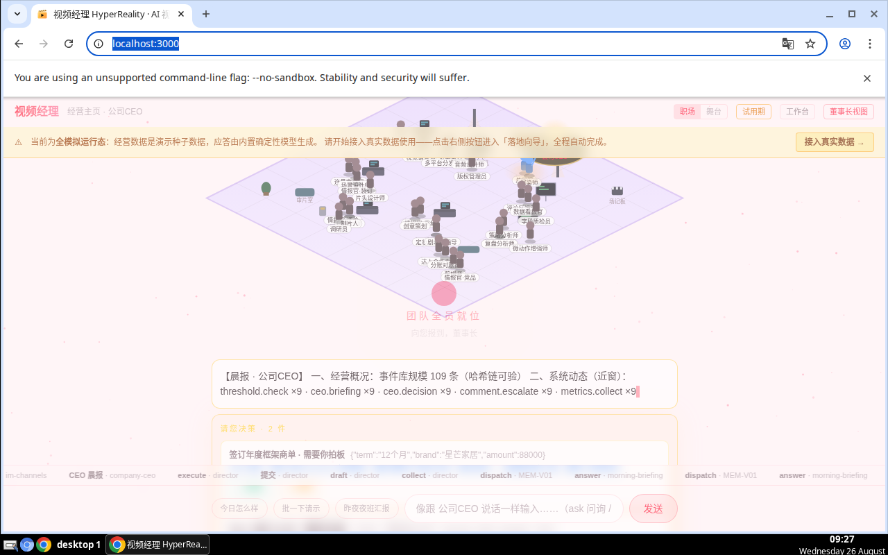
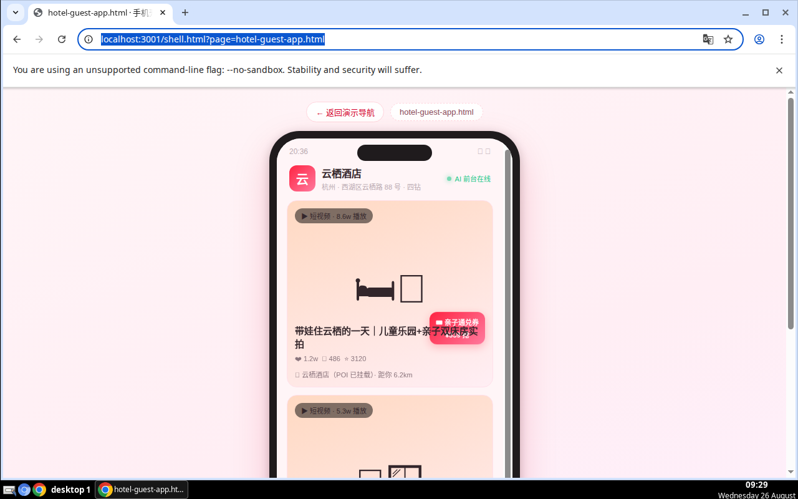
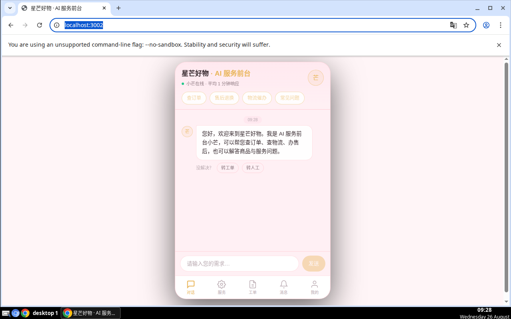

# workloom-ai-acquisition · 能力导览（人类版）

> WorkLoom 获客系统 · 短视频社媒营销 × GEO × 获客五环 × 行业运营（首垂直：酒店）
> 本文件由 `node scripts/generate-capabilities.mjs` 从代码事实**自动生成**（2026-08-27），
> 请勿手改——能力变更后重跑生成器即可。Agent 版机器清单见 docs/capability-map.md。

## 🚀 5 分钟体验路径

```bash
pnpm install && pnpm preview:all
```

| 端 | 地址 | 看什么 |
|---|---|---|
| 🖥 PC · B 端工作台 | http://localhost:3000 | 经营主页全员就位、晨报、待审批、一句话目标输入 |
| 📱 B 端移动 | http://localhost:3001 | 演示导航页 → 任选高保真页「手机壳」预览 |
| 📱 C 端 AI 服务前台 | http://localhost:3002 | 免登对话：查订单/售后/物流/常见问题 |

无需任何真实后端或密钥：Mock 数据（种子 + 离线确定性模型 + 演示直登）已固化，详见 mock/README.md。

| PC 端 | B 端移动（手机壳） | C 端移动 |
|---|---|---|
|  |  |  |

## 📦 能力总览（32 项）

### 🖥 三端应用（开箱即看）

| 能力 | 一句话 | 怎么体验 |
|---|---|---|
| **PC 端 · B 端工作台** | 经营主页/任务中心/规则中心/装配中心，全模拟运行态 | `pnpm preview:all` → http://localhost:3000 |
| **移动端 · B 端高保真** | 12 页高保真演示页 + 手机壳容器 | `pnpm preview:all` → http://localhost:3001 |
| **移动端 · C 端 AI 服务前台** | 小程序入口 H5 模拟：对话/服务/工单/消息/我的，演示直登 | `pnpm preview:all` → http://localhost:3002 |

### 🏨 行业 Bundle（垂直能力包）

| 能力 | 一句话 | 怎么体验 |
|---|---|---|
| **bundles/ai-video/** | 围栏/技能/员工/对象/管线一键装配 | 见 bundles/ai-video/ 目录 |
| **bundles/geo-growth/** | 围栏/技能/员工/对象/管线一键装配 | 见 bundles/geo-growth/ 目录 |
| **bundles/hotel/** | 围栏/技能/员工/对象/管线一键装配 | 见 bundles/hotel/ 目录 |

### 🤖 AI 自动化引擎（系统内置能力）

| 能力 | 一句话 | 怎么体验 |
|---|---|---|
| **围栏 DSL 引擎** | 事前裁决：支持 in/contains_any 列表语义 | 见 docs/capability-map.md L3 |
| **L2 编排（ASK/QUEST）** | 一句话目标自动拆解多步骤并派发 | 见 docs/capability-map.md L3 |
| **夜班自动运行** | 离线任务推进，次日晨报 | 见 docs/capability-map.md L3 |
| **模型路由** | 离线确定性模型，无密钥可跑 | 见 docs/capability-map.md L3 |
| **全平台 RPA 发布** | 抖音/小红书/B站/YouTube，BrowserDriver 注入接真浏览器 | 见 docs/capability-map.md L3 |
| **五元事件 + RLS 隔离** | 全链路可追溯、可验链 | 见 docs/capability-map.md L3 |
| **IM 渠道** | 企微等出入站，审批卡片直达手机 | 见 docs/capability-map.md L3 |
| **C 端 AI 服务前台** | 对话/知识库 385 问/工单/SLA | 见 docs/capability-map.md L3 |
| **自动巡检** | 异常发现→派发→处置闭环 | 见 docs/capability-map.md L3 |
| **人审台** | 必审事项人拍板，AI 不越权 | 见 docs/capability-map.md L3 |
| **资产管理** | 素材/成片全生命周期 | 见 docs/capability-map.md L3 |
| **成本台账** | 每次模型调用可计量 | 见 docs/capability-map.md L3 |
| **交易流** | 商机到成交全链路 | 见 docs/capability-map.md L3 |
| **社媒监听** | 评论/询盘意图雷达 | 见 docs/capability-map.md L3 |

### ✅ 验证与质量（工程纪律）

| 能力 | 一句话 | 怎么体验 |
|---|---|---|
| **主测试套件** | 数百条场景用例逐条执行 | `pnpm suite` |
| **GEO 域套件** | GEO 双域专项 | `pnpm suite:geo` |
| **酒店域套件** | 酒店域专项 | `pnpm suite:hotel` |
| **发布门禁** | 未全过禁止发布（硬性） | `pnpm release:gate` |
| **五元事件验链** | 事件链完整性校验 | `pnpm db:verify-chain` |
| **Agent 能力巡游** | AI Agent 一键自检全部能力 | `pnpm agent:tour` |
| **环境自检** | 一屏排查环境问题 | `pnpm doctor` |

### 🎁 演示与交付资产

| 能力 | 一句话 | 怎么体验 |
|---|---|---|
| **高保真演示页 ×12** | 糖果色，含手机壳容器 | http://localhost:3001 |
| **官网静态站** | 对外产品故事 | apps/site/index.html |
| **自带技能 ×7** | cross-platform-review / deal-flow / demo-mirror / industry-entry 等 | skills/official/ |
| **能力导览 PPT** | 路演/汇报直接用 | docs/capability-tour.pptx |
| **Mock 数据体系** | 种子 + 离线模型 + 演示直登，开箱即用 | mock/README.md |

## 🧭 下一步

- 想二次开发：读 AGENTS.md → 跑 `pnpm agent:tour` → 看 docs/capability-map.md（全量机器清单）
- 想改 UI：必须遵守 docs/design-system.md（Candy Design System），改完用浏览器能力截图核对
- 想发布：`pnpm release:gate` 全过是硬性门禁，清单见 docs/release-checklist.md
